# 🎬 Keyframe Selection Pipeline - Architecture Documentation

**Temporal-Aware Keyframe Selection with Multiple Selection Methods**

| Feature | Status |
|---------|--------|
| CLIP & DINOv3 Encoders | ✅ |
| DPP Diversity Selection | ✅ |
| K-means Clustering | ✅ |
| HDBSCAN Density-Based | ✅ |
| Motion Awareness | ✅ |
| Backward Compatibility | ✅ |

---

## Table of Contents

1. [Main Pipeline Flow](#main-pipeline-flow)
2. [Selection Methods](#selection-methods)
3. [Data Structures](#data-structures)
4. [Configuration Hierarchy](#configuration-hierarchy)
5. [Module Dependencies](#module-dependencies)
6. [Hyperparameters](#hyperparameters)
7. [Key Algorithms](#key-algorithms)
8. [Files Reference](#files-reference)

---

## Main Pipeline Flow

The pipeline executes seven distinct stages to process video and select keyframes:

```mermaid
flowchart TB
    subgraph Input["INPUT"]
        VideoFile["📹 Video File"]
        FrameDir["📁 Frame Directory"]
    end

    subgraph Stage1["STAGE 1: FRAME SAMPLING"]
        FrameSampler["FrameSampler"]
        FrameBatch["FrameBatch"]
    end

    subgraph Stage2["STAGE 2: IMAGE ENCODING"]
        EncoderSwitch{{"Encoder?"}}
        CLIPEnc["CLIP Encoder"]
        DINOEnc["DINOv3 Encoder"]
        TemporalEnc["Temporal Encoding"]
    end

    subgraph Stage2b["STAGE 2B: MOTION Optional"]
        MotionEnc["Motion Encoder"]
        OpticalFlow["Optical Flow"]
    end

    subgraph Stage3["STAGE 3: TEMPORAL ANALYSIS"]
        TemporalDelta["Compute L2 Deltas"]
        ChangePoints["Detect Change Points"]
    end

    subgraph Stage4["STAGE 4: K DETERMINATION"]
        KMethod{{"Selection Method?"}}
        EntropyK["Entropy Est. (DPP/K-means)"]
        HDBSCANAuto["Auto K (HDBSCAN)"]
    end

    subgraph Stage5["STAGE 5: KERNEL & SELECTION"]
        DPPKernel["DPP Kernel Build (DPP only)"]
        Selection{{"Dispatch to Method"}}
        DPPSel["DPP Selection"]
        KMeansSel["K-means Selection"]
        HDBSCANSel["HDBSCAN Selection"]
    end

    subgraph Output["OUTPUT"]
        KeyframeResult["KeyframeResult"]
        SaveFrames["Save Keyframes"]
    end

    VideoFile --> FrameSampler
    FrameDir --> FrameSampler
    FrameSampler --> FrameBatch
    FrameBatch --> EncoderSwitch
    EncoderSwitch -->|clip| CLIPEnc
    EncoderSwitch -->|dinov3| DINOEnc
    CLIPEnc --> TemporalEnc
    DINOEnc --> TemporalEnc
    TemporalEnc --> MotionEnc
    OpticalFlow --> MotionEnc
    MotionEnc --> TemporalDelta
    TemporalDelta --> ChangePoints
    ChangePoints --> KMethod
    KMethod -->|dpp/kmeans| EntropyK
    KMethod -->|hdbscan| HDBSCANAuto
    EntropyK --> DPPKernel
    HDBSCANAuto --> Selection
    DPPKernel --> Selection
    Selection -->|dpp| DPPSel
    Selection -->|kmeans| KMeansSel
    Selection -->|hdbscan| HDBSCANSel
    DPPSel --> KeyframeResult
    KMeansSel --> KeyframeResult
    HDBSCANSel --> KeyframeResult
    KeyframeResult --> SaveFrames
```



**Key Features:**
- Conditional K estimation based on selection method
- Kernel construction only when needed (DPP)
- Clean method dispatch architecture
- Efficient data flow with temporal awareness

---

## Selection Methods

The pipeline supports three distinct keyframe selection strategies:

### Selection Methods Overview


### 1. DPP (Determinantal Point Process) - Default

**Characteristics:**
- Diversity-aware selection using point processes
- Considers both feature and temporal similarity
- Options: Stochastic sampling or greedy MAP inference
- Best for: Diverse, well-distributed keyframes
- Uses: Fixed K or entropy-based adaptive K

**Advantages:**
- Mathematical diversity guarantees
- Balances coverage and diversity
- Backward compatible (default method)

**Configuration:**
```yaml
selector:
  method: dpp
  mode: sample          # or "map"
  include_change_points: true
  fixed_k: null         # or specify number
```

---

### 2. K-means Clustering

**Characteristics:**
- Fixed K clustering of embeddings
- Selects medoid (closest to center) from each cluster
- Configurable initialization and iterations
- Best for: Uniform coverage with fixed keyframe count
- Parameters: init, n_init, max_iter, fixed_k

**Advantages:**
- Simple and interpretable
- Guaranteed K keyframes
- Fast clustering algorithm
- Good for streaming scenarios

**Configuration:**
```yaml
selector:
  method: kmeans
  fixed_k: 10
  kmeans_init: k-means++
  kmeans_n_init: 10
  kmeans_max_iter: 300
```

---

### 3. HDBSCAN (Hierarchical Density-Based)

**Characteristics:**
- Automatic cluster detection based on density
- No need to specify target K
- Handles noise points as separate cluster
- Best for: Variable-length videos with natural clusters
- Parameters: min_cluster_size, cluster_selection_method

**Advantages:**
- Automatic K discovery
- Handles variable-length videos
- Robust to outliers
- No parameter tuning for K

**Configuration:**
```yaml
selector:
  method: hdbscan
  hdbscan_min_cluster_size: 3
  hdbscan_min_samples: null
  hdbscan_cluster_selection_epsilon: 0.0
  hdbscan_cluster_selection_method: eom
```

---

### Method Dispatch Architecture

```python
if config.method == "dpp":
    return _select_dpp(kernel, k, change_points)
elif config.method == "kmeans":
    return _select_kmeans(embeddings, k)
elif config.method == "hdbscan":
    return _select_hdbscan(embeddings)
else:
    raise ValueError(f"Unknown selection method: {config.method}")
```

---

## Data Structures

### Data Type Pipeline Flow


### Data Type Pipeline Details

| Stage | Input Type | Output Type | Purpose |
|-------|-----------|-------------|---------|
| 1. Frame Sampling | FrameData | FrameBatch | Extracted video frames |
| 2. Image Encoding | FrameBatch | EmbeddingBatch | CLIP/DINOv3 embeddings |
| 3. Temporal Analysis | EmbeddingBatch | TemporalAnalysisResult | Scene change detection |
| 4. Entropy Estimation | EmbeddingBatch + TemporalAnalysisResult | EntropyResult | Adaptive K estimation |
| 5. DPP Kernel | EmbeddingBatch | DPPKernel | Similarity kernel matrix |
| 6. Selection | EmbeddingBatch + DPPKernel | KeyframeResult | Selected keyframe indices |
| 7. Output | KeyframeResult + FrameBatch | PipelineResult | Final results with metadata |

**Key Types:**
- **FrameBatch**: Collection of extracted frames with timestamps
- **EmbeddingBatch**: Feature vectors from encoder with temporal info
- **TemporalAnalysisResult**: Change points and temporal deltas
- **KeyframeResult**: Selected frame indices and confidence scores
- **DPPKernel**: NxN similarity matrix for diversity computation

---

## Configuration Hierarchy

### Configuration Flow


### Complete Configuration Structure

```
PipelineConfig
├── FrameSamplingConfig
│   ├── fps: 1.0
│   └── adaptive: false
│
├── CLIPEncoderConfig / DINOv3EncoderConfig
│   ├── model_name / model_id
│   └── temporal_weight: 0.1
│
├── TemporalAnalysisConfig
│   ├── delta_percentile: 90.0
│   └── min_segment_frames: 3
│
├── EntropyEstimatorConfig
│   ├── beta: 1.0
│   ├── k_min: 3
│   └── k_max: 50
│
├── DPPKernelConfig
│   ├── sigma_f: null (median heuristic)
│   └── sigma_t_ratio: 0.2
│
├── SelectorConfig (Method Dispatch)
│   ├── method: "dpp" | "kmeans" | "hdbscan"
│   │
│   ├── If method="dpp":
│   │   ├── mode: "sample" | "map"
│   │   └── include_change_points: true
│   │
│   ├── If method="kmeans":
│   │   ├── kmeans_init: "k-means++"
│   │   ├── kmeans_n_init: 10
│   │   └── kmeans_max_iter: 300
│   │
│   └── If method="hdbscan":
│       ├── hdbscan_min_cluster_size: 2
│       ├── hdbscan_min_samples: null
│       └── hdbscan_cluster_selection_method: "eom"
│
└── MotionConfig
    ├── enabled: false
    └── gamma: 0.1
```

### Configuration Examples

**DPP (Default, Backward Compatible):**
```yaml
selector:
  method: dpp
  mode: sample
  include_change_points: true
```

**K-means with Fixed K:**
```yaml
selector:
  method: kmeans
  fixed_k: 10
  kmeans_init: k-means++
```

**HDBSCAN with Auto K:**
```yaml
selector:
  method: hdbscan
  hdbscan_min_cluster_size: 3
```

---

## Module Dependencies

### Dependency Graph


### Module Relationships

| Module | Dependencies | Purpose |
|--------|--------------|---------|
| **types.py** | - | Base data structures (no dependencies) |
| **config.py** | types.py | Configuration classes |
| **frame_sampling.py** | types.py, config.py | Frame extraction logic |
| **selector.py** | types.py, config.py | Selection implementations |
| **pipeline.py** | types.py, config.py, frame_sampling.py, selector.py | Main orchestration |
| **run_pipeline.py** | pipeline.py, config.py | CLI entry point |

**Design Principles:**
- Types form the foundation
- Config is independent of business logic
- Selection logic is isolated in selector.py
- Pipeline orchestrates all components
- CLI wraps pipeline for user interaction

---

## Hyperparameters

### DPP Parameters

| Parameter | Default | Description |
|-----------|---------|-------------|
| method | dpp | Selection method (dpp, kmeans, hdbscan) |
| mode | sample | DPP mode: sample (stochastic) or map (greedy) |
| fixed_k | null | Fixed number of keyframes (null = use entropy-based) |
| include_change_points | true | Include detected scene transitions |

### K-means Parameters

| Parameter | Default | Description |
|-----------|---------|-------------|
| kmeans_init | k-means++ | Initialization method: k-means++ or random |
| kmeans_n_init | 10 | Number of times K-means runs with different inits |
| kmeans_max_iter | 300 | Maximum iterations for K-means |
| fixed_k | null | Number of clusters (required for K-means) |

### HDBSCAN Parameters

| Parameter | Default | Description |
|-----------|---------|-------------|
| hdbscan_min_cluster_size | 2 | Minimum cluster size for HDBSCAN |
| hdbscan_min_samples | null | Minimum samples (null = same as min_cluster_size) |
| hdbscan_cluster_selection_epsilon | 0.0 | Epsilon for cluster selection |
| hdbscan_cluster_selection_method | eom | Method: eom (excess of mass) or leaf |

### Common Parameters (All Methods)

| Parameter | Default | Description |
|-----------|---------|-------------|
| min_frame_gap | 5 | Minimum gap between keyframes (all methods) |
| seed | 42 | Random seed for reproducibility |
| num_samples | 1 | Number of stochastic samples (DPP) |

---

## Key Algorithms

### Algorithm Comparison

```mermaid
graph TD
    A["Keyframe Selection Algorithm"]
    A --> B{{"Which Method?"}}
    
    B -->|DPP| C["DPP Algorithm"]
    C --> C1["1. Build Kernel Matrix<br/>Feature + Temporal Similarity"]
    C1 --> C2["2. Estimate K<br/>via Entropy Formula"]
    C2 --> C3["3. Sample from DPP<br/>Stochastic or MAP"]
    C3 --> C4["✓ Diversity Guaranteed<br/>✓ Well-distributed frames"]
    
    B -->|K-means| D["K-means Algorithm"]
    D --> D1["1. Fix K = fixed_k parameter<br/>or estimate via entropy"]
    D1 --> D2["2. Initialize K cluster centers<br/>k-means++ or random"]
    D2 --> D3["3. Iteratively optimize<br/>until convergence"]
    D3 --> D4["4. Select medoid<br/>from each cluster"]
    D4 --> D5["✓ Fixed K Guaranteed<br/>✓ Fast Clustering"]
    
    B -->|HDBSCAN| E["HDBSCAN Algorithm"]
    E --> E1["1. Build mutual<br/>reachability graph"]
    E1 --> E2["2. Auto-detect K<br/>via density analysis"]
    E2 --> E3["3. Extract clusters<br/>at optimal threshold"]
    E3 --> E4["4. Select medoid<br/>from each cluster"]
    E4 --> E5["✓ Auto K Discovery<br/>✓ Handles Outliers"]
```



### Adaptive K Formula (DPP & K-means)

```
K = β · √N · H · (1 + mean(Δ))

Where:
  β   = Scaling factor (default 1.0)
  N   = Number of frames
  H   = Normalized Shannon entropy
  Δ   = Temporal deltas (L2 distance between consecutive embeddings)
```

**Purpose:** Automatically determine optimal number of keyframes based on content complexity and temporal variance.

---

### DPP Kernel Construction

```
Feature Kernel:
  K_f(i,j) = exp(-||f_i - f_j||² / σf²)

Temporal Kernel:
  K_t(i,j) = exp(-|t_i - t_j|² / σt²)

Combined:
  K = K_f ⊙ K_t  (Hadamard product)
```

**Parameters:**
- `σf`: Feature similarity bandwidth (default: median heuristic)
- `σt_ratio`: Temporal kernel ratio (default: 0.2)

**Purpose:** Create a diversity-aware kernel that balances feature and temporal similarity.

---

### K-means Medoid Selection

```
For each cluster i:
  1. Compute cluster center: c_i = mean(cluster_members)
  2. Find medoid: medoid = argmin(||f - c_i||)
  3. Select medoid as keyframe
  4. Apply min_frame_gap filtering
```

**Advantages:**
- Simple and interpretable
- Guaranteed to select actual frames (medoids)
- Efficient computation
- Deterministic results

---

### HDBSCAN Medoid Selection

```
For each cluster (including noise):
  1. Compute cluster mean: center = mean(cluster_members)
  2. Find medoid: medoid = argmin(||f - center||)
  3. Select medoid as keyframe
  4. Apply min_frame_gap filtering
  5. Return variable K based on detected clusters
```

**Advantages:**
- Automatically determines K
- Handles outliers naturally
- Robust to cluster shapes
- No manual K tuning

---

## Files Reference

### Core Modules

| File | Purpose | Key Changes |
|------|---------|------------|
| **config.py** | Configuration classes | Extended SelectorConfig with method selection |
| **selector.py** | Selection implementations | Added K-means and HDBSCAN methods |
| **pipeline.py** | Main orchestration | Conditional kernel building, method dispatch |
| **run_pipeline.py** | CLI entry point | Added selection method arguments |
| **types.py** | Data structures | No changes (compatible with all methods) |
| **clip_encoder.py** | CLIP embeddings | No changes |
| **dinov3_encoder.py** | DINOv3 embeddings | No changes |
| **frame_sampling.py** | Frame extraction | Extracted frames with timestamps |

---

### Configuration Files

| File | Purpose | Example |
|------|---------|---------|
| **config.example.yaml** | Default configuration | DPP with CLIP encoder |
| **config.dinov3.example.yaml** | DINOv3 variant | DPP with DINOv3 encoder |
| **config.clip.kmeans.example.yaml** | CLIP + K-means | K-means clustering setup |
| **config.dinov3.kmeans.example.yaml** | DINOv3 + K-means | K-means clustering setup |
| **config.clip.hdbscan.example.yaml** | CLIP + HDBSCAN | HDBSCAN clustering setup |
| **config.dinov3.hdbscan.example.yaml** | DINOv3 + HDBSCAN | HDBSCAN clustering setup |

---

## Usage Examples

### Default DPP (Backward Compatible)

```bash
# Minimal usage
python run_pipeline.py --frames ./frames --output ./output

# With configuration file
python run_pipeline.py --config config.example.yaml

# With custom settings
python run_pipeline.py --frames ./frames --output ./output \
  --encoder clip --dpp-mode sample
```

---

### K-means Clustering

```bash
# Basic K-means with 10 clusters
python run_pipeline.py --frames ./frames --output ./output \
  --selection-method kmeans -k 10

# K-means with random initialization
python run_pipeline.py --frames ./frames --output ./output \
  --selection-method kmeans -k 15 --kmeans-init random

# K-means with configuration file
python run_pipeline.py --config config.dinov3.kmeans.example.yaml
```

---

### HDBSCAN Density-Based

```bash
# Basic HDBSCAN with default parameters
python run_pipeline.py --frames ./frames --output ./output \
  --selection-method hdbscan

# HDBSCAN with custom minimum cluster size
python run_pipeline.py --frames ./frames --output ./output \
  --selection-method hdbscan --hdbscan-min-cluster-size 5

# HDBSCAN with configuration file
python run_pipeline.py --config config.dinov3.hdbscan.example.yaml
```

---

## Method Selection Guide

```mermaid
graph TD
    A["Select Keyframe Method"]
    A --> B{{"What's your priority?"}}
    
    B -->|Maximum Diversity<br/>Mathematical Guarantees| C["🎯 DPP Method"]
    C --> C1["Best for:<br/>- General purpose extraction<br/>- Diverse keyframes needed<br/>- Backward compatibility"]
    C --> C2["Config:<br/>method: dpp<br/>mode: sample or map"]
    
    B -->|Fixed Number<br/>of Keyframes| D["🎯 K-means Method"]
    D --> D1["Best for:<br/>- Fixed K requirement<br/>- Uniform coverage<br/>- Consistent output size"]
    D --> D2["Config:<br/>method: kmeans<br/>fixed_k: 10"]
    
    B -->|Auto-adaptive<br/>Keyframe Count| E["🎯 HDBSCAN Method"]
    E --> E1["Best for:<br/>- Variable length videos<br/>- No K tuning<br/>- Natural clusters"]
    E --> E2["Config:<br/>method: hdbscan<br/>min_cluster_size: 3"]
```



## Summary

The keyframe selection pipeline provides a flexible, production-ready solution for intelligent video keyframe extraction. With support for three distinct selection methods (DPP, K-means, HDBSCAN), it caters to diverse use cases:

- **DPP**: For mathematically grounded diversity
- **K-means**: For consistent, fixed-count extraction
- **HDBSCAN**: For adaptive, density-aware selection

The architecture maintains backward compatibility while providing extensible hooks for future selection methods. Configuration is centralized and hierarchical, enabling easy experimentation with different parameter combinations.

---

**Last Updated:** January 20, 2026  
**Version:** 2.0 (Multi-Method Support)  
**Status:** Production Ready ✅
