# Keyframe Selection Pipeline Flowchart

```mermaid
flowchart TB
    subgraph INPUT["📥 INPUT"]
        VIDEO["🎬 Video File"]
        FRAMES_DIR["📁 Frame Directory"]
    end

    subgraph STAGE1["<b>Stage 1: Frame Sampling</b>"]
        S1_FPS["FPS Sampling"]
        S1_ADAPTIVE["Adaptive Scene Detection"]
        S1_OUTPUT["FrameBatch"]
    end

    subgraph STAGE2["<b>Stage 2: Image Encoding</b>"]
        S2_CLIP["CLIP Encoder<br/>(ViT-L/14, ViT-B/32, etc.)"]
        S2_DINO["DINOv3 Encoder<br/>(dinov2-base, etc.)"]
        S2_TEMPORAL["Temporal Encoding<br/>(optional)"]
        S2_EMBED["EmbeddingBatch"]
    end

    subgraph STAGE2B["<b>Stage 2b: Motion Encoding</b> (Optional)"]
        S2B_FLOW["Optical Flow<br/>Computation"]
        S2B_AUGMENT["Embedding<br/>Augmentation"]
        S2B_FEATURES["Motion Features"]
    end

    subgraph STAGE3["<b>Stage 3: Temporal Analysis</b>"]
        S3_DELTA["Compute L2 Deltas<br/>Δt = ||f̃t - f̃t-1||"]
        S3_SMOOTH["EMA Smoothing<br/>(optional)"]
        S3_THRESHOLD["Percentile<br/>Thresholding"]
        S3_CP["Change Point<br/>Detection"]
        S3_TEMP_RESULT["TemporalAnalysisResult"]
    end

    subgraph STAGE4["<b>Stage 4: K Determination</b>"]
        S4_ENTROPY["Entropy-Based<br/>Estimation"]
        S4_FIXED["Fixed K<br/>(if set)"]
        S4_HDBSCAN["HDBSCAN<br/>(auto K)"]
        S4_K["Target K Value"]
    end

    subgraph STAGE5["<b>Stage 5: DPP Kernel</b> (DPP method)"]
        S5_FEATURE["Feature Kernel<br/>Kf(x,y)"]
        S5_TEMPORAL["Temporal Kernel<br/>Kt(i,j)"]
        S5_COMBINE["Combine:<br/>K = Kf ⊗ Kt"]
        S5_KERNEL["DPP Kernel Matrix"]
    end

    subgraph STAGE6["<b>Stage 6: Selection</b>"]
        S6_DPP["DPP Sampling<br/>(dppy library)"]
        S6_GREEDY["Greedy MAP<br/>(fallback)"]
        S6_KMEANS["K-Means<br/>Clustering"]
        S6_HDBSCAN["HDBSCAN<br/>Clustering"]
        S6_RESULT["KeyframeResult"]
    end

    subgraph OUTPUT["📤 OUTPUT"]
        OUT_FRAMES["Selected<br/>Keyframes"]
        OUT_JSON["Metadata JSON"]
    end

    %% Connections - Stage 1
    VIDEO --> S1_FPS
    FRAMES_DIR --> S1_FPS
    S1_FPS --> S1_ADAPTIVE
    S1_ADAPTIVE --> S1_OUTPUT

    %% Connections - Stage 2
    S1_OUTPUT --> S2_CLIP
    S1_OUTPUT --> S2_DINO
    S2_CLIP --> S2_TEMPORAL
    S2_DINO --> S2_TEMPORAL
    S2_TEMPORAL --> S2_EMBED

    %% Connections - Stage 2b (Motion)
    S2_EMBED --> S2B_FLOW
    S2B_FLOW --> S2B_AUGMENT
    S2B_AUGMENT --> S2B_FEATURES
    S2B_FEATURES -.-> S2_EMBED

    %% Connections - Stage 3
    S2_EMBED --> S3_DELTA
    S3_DELTA --> S3_SMOOTH
    S3_SMOOTH --> S3_THRESHOLD
    S3_THRESHOLD --> S3_CP
    S3_CP --> S3_TEMP_RESULT

    %% Connections - Stage 4
    S2_EMBED --> S4_ENTROPY
    S3_TEMP_RESULT --> S4_ENTROPY
    S4_ENTROPY --> S4_K
    S4_FIXED --> S4_K
    S4_HDBSCAN --> S4_K

    %% Connections - Stage 5
    S2_EMBED --> S5_FEATURE
    S3_TEMP_RESULT --> S5_TEMPORAL
    S5_FEATURE --> S5_COMBINE
    S5_TEMPORAL --> S5_COMBINE
    S5_COMBINE --> S5_KERNEL

    %% Connections - Stage 6
    S5_KERNEL --> S6_DPP
    S2_EMBED --> S6_KMEANS
    S2_EMBED --> S6_HDBSCAN
    S3_TEMP_RESULT --> S6_GREEDY
    S3_TEMP_RESULT --> S6_HDBSCAN
    S4_K --> S6_DPP
    S4_K --> S6_KMEANS
    S6_DPP --> S6_RESULT
    S6_GREEDY --> S6_RESULT
    S6_KMEANS --> S6_RESULT
    S6_HDBSCAN --> S6_RESULT

    %% Connections - Output
    S6_RESULT --> OUT_FRAMES
    S1_OUTPUT -.-> OUT_JSON

    %% Styling
    style INPUT fill:#e1f5fe,stroke:#01579b,color:#000
    style STAGE1 fill:#fff3e0,stroke:#e65100,color:#000
    style STAGE2 fill:#e8f5e9,stroke:#1b5e20,color:#000
    style STAGE2B fill:#f3e5f5,stroke:#4a148c,color:#000
    style STAGE3 fill:#fce4ec,stroke:#880e4f,color:#000
    style STAGE4 fill:#fff9c4,stroke:#f57f17,color:#000
    style STAGE5 fill:#e0f7fa,stroke:#006064,color:#000
    style STAGE6 fill:#f1f8e9,stroke:#33691e,color:#000
    style OUTPUT fill:#e8eaf6,stroke:#283593,color:#000

    %% Branch indicators
    S2_CLIP ~~~ S2_DINO
    S6_DPP ~~~ S6_GREEDY
```

## Pipeline Stages Summary

| Stage | Component | Description |
|-------|-----------|-------------|
| 1 | **Frame Sampling** | Extract frames from video at specified FPS or using adaptive scene detection |
| 2 | **Image Encoding** | Generate semantic embeddings using CLIP or DINOv3 encoders with optional temporal encoding |
| 2b | **Motion Encoding** *(optional)* | Compute optical flow features and augment embeddings for action-heavy videos |
| 3 | **Temporal Analysis** | Compute L2 deltas between consecutive embeddings to detect scene changes |
| 4 | **K Determination** | Estimate optimal keyframe count using entropy-based method, fixed K, or HDBSCAN |
| 5 | **DPP Kernel** | Build similarity kernel combining feature and temporal components |
| 6 | **Selection** | Select diverse keyframes using DPP, K-means, or HDBSCAN clustering |

## Ablation Support

The pipeline supports toggling these components for ablation studies:
- **Temporal Encoding** (H4): Enable/disable temporal awareness in embeddings
- **Entropy-Based K** (H5-H6): Use adaptive K estimation or fixed value
- **Temporal Kernel** (H7-H8): Include temporal distance in DPP kernel
- **Motion Awareness** (H10): Enable optical flow features
